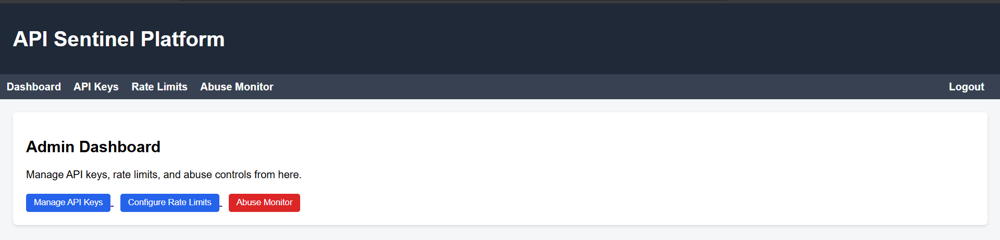
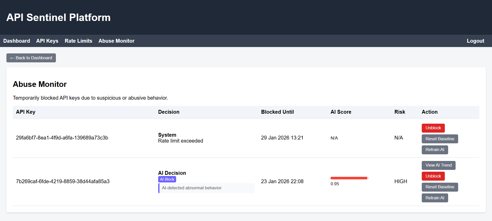
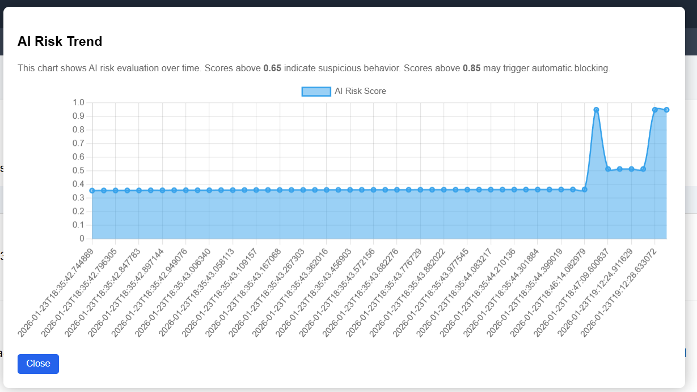

# API Sentinel 🛡️

**Intelligent API Governance Platform**

A backend-focused API governance and security platform built with Spring Boot that enforces rate limiting, abuse detection, and AI-assisted anomaly analysis for modern API ecosystems.

[](https://www.oracle.com/java/)
[](https://spring.io/projects/spring-boot)
[](https://www.postgresql.org/)
[](https://redis.io/)
[](LICENSE)

---

## 📋 Table of Contents

- [Overview](#overview)
- [Key Features](#key-features)
- [Architecture](#architecture)
- [Tech Stack](#tech-stack)
- [Project Structure](#project-structure)
- [Screenshots](#screenshots)
- [Getting Started](#getting-started)
- [Design Philosophy](#design-philosophy)
- [Future Enhancements](#future-enhancements)
- [License](#license)
- [Author](#author)

---

## 🎯 Overview

API Sentinel protects your APIs from abuse and abnormal traffic patterns through a multi-layered approach combining deterministic backend logic with AI-assisted risk analysis. All enforcement decisions remain **backend-driven and explainable**, with AI serving as a supporting subsystem rather than core logic.

> **Perfect for:** Production API platforms requiring robust governance, security teams needing visibility into API abuse patterns, and developers building scalable API infrastructure.

---

## ✨ Key Features

### 🔐 API Key Management
- Secure API key validation and activation
- Plan-based rate limit enforcement
- Usage tracking and analytics
- Admin revocation support

### ⚡ Rate Limiting Engine
- **Redis-backed sliding window algorithm**
- Per-plan request thresholds
- Automatic temporary blocking on violations
- Cooldown-based recovery mechanism

### 🚨 Abuse Detection System
- Centralized blocking logic
- Hybrid Redis + Database enforcement
- Distinguishes between **SYSTEM** and **AI-triggered** blocks
- Prevents stale or duplicate blocks

### 🧠 AI-Assisted Anomaly Detection
- Per-API-key baseline learning
- Adaptive thresholds based on traffic maturity
- **Explainable AI decisions** with human-readable reasons
- No blocking during warm-up phase
- Fully overrideable by administrators

### 📊 Baseline Learning System
- Rolling averages for traffic patterns
- Request rate and endpoint diversity analysis
- Sample-based maturity gate
- Continuous learning and adaptation

### 📈 Admin Dashboard
- Real-time blocked API monitoring
- AI confidence levels and risk scores
- Detailed AI explanations per block
- Historical AI score trend visualization
- Manual unblock controls
- Baseline reset and retraining tools

---

## 🏗️ Architecture

```
┌─────────────────────────────────────────────────┐
│                   Client                        │
└──────────────────┬──────────────────────────────┘
                   │
                   ▼
┌─────────────────────────────────────────────────┐
│            API Gateway Filter                   │
└──────────────────┬──────────────────────────────┘
                   │
                   ▼
┌─────────────────────────────────────────────────┐
│         API Key Authentication                  │
└──────────────────┬──────────────────────────────┘
                   │
                   ▼
┌─────────────────────────────────────────────────┐
│        Rate Limiting (Redis)                    │
└──────────────────┬──────────────────────────────┘
                   │
                   ▼
┌─────────────────────────────────────────────────┐
│      AI Risk Evaluation (Explainable)           │
└──────────────────┬──────────────────────────────┘
                   │
                   ▼
┌─────────────────────────────────────────────────┐
│       Abuse Detection & Blocking                │
└──────────────────┬──────────────────────────────┘
                   │
                   ▼
┌─────────────────────────────────────────────────┐
│   Admin Dashboard (Monitoring & Control)        │
└─────────────────────────────────────────────────┘
```

---

## 🛠️ Tech Stack

### Backend
- **Java 21** - Modern Java features and performance
- **Spring Boot** - Application framework
- **Spring MVC** - Web layer
- **Spring Data JPA** - Data persistence
- **Hibernate** - ORM
- **Spring Security** - Filter-based security

### Data & Caching
- **PostgreSQL** - Primary database
- **Redis** - Caching and rate limiting

### AI & Analytics
- Baseline deviation analysis
- Explainable AI scoring engine
- Adaptive threshold algorithms
- Time-series risk tracking

### Frontend (Admin Panel)
- **Thymeleaf** - Server-side templating
- **HTML/CSS** - UI styling
- **Chart.js** - Data visualization

### DevOps
- Docker-ready architecture
- Stateless backend design
- Cloud-deployable infrastructure

---

## 📁 Project Structure

```
api-sentinel/
├── security/              # API filters & enforcement
├── rate_limit/            # Rate limiting engine
├── abuse/                 # Blocking & cooldown logic
├── ai/                    # AI analysis & baselines
├── controller/admin/      # Admin controllers
├── domain/                # JPA entities
├── repository/            # Data access layer
├── templates/             # Thymeleaf UI templates
└── ApiGovernanceApplication.java
```

---

## 📸 Screenshots

### Dashboard Overview


### Abuse Monitor with AI Explanation


### AI Risk Score Trend


### Baseline Controls


---

## 🚀 Getting Started

### Prerequisites
- Java 17 or higher
- PostgreSQL 12+
- Redis 6+
- Maven 3.8+

### Installation

1. **Clone the repository**
   ```bash
   git clone https://github.com/abhikay18/api-sentinel.git
   cd api-sentinel
   ```

2. **Configure application properties**
   ```bash
   cp src/main/resources/application.properties.example src/main/resources/application.properties
   # Edit application.properties with your database and Redis credentials
   ```

3. **Build the project**
   ```bash
   mvn clean install
   ```

4. **Run the application**
   ```bash
   mvn spring-boot:run
   ```

5. **Access the admin dashboard**
   ```
   http://localhost:8080/admin
   ```

### Testing

Run the test suite:
```bash
mvn test
```

Trigger AI anomaly detection (testing endpoint):
```bash
curl -X POST http://localhost:8080/test/trigger-anomaly?apiKey=YOUR_API_KEY
```

---

## 💡 Design Philosophy

API Sentinel follows production-grade principles:

- **Backend logic is authoritative** - All enforcement decisions are deterministic
- **AI provides signals, not decisions** - AI assists but doesn't control
- **Every AI action is:**
  - 📝 Logged for audit trails
  - 📖 Explainable with human-readable reasons
  - 🔄 Overrideable by administrators
- **System remains functional without AI** - Core features work independently

This mirrors real-world production API security systems used by major platforms.

---

## 🚧 Future Enhancements

- [ ] OAuth2 / JWT authentication support
- [ ] Prometheus & Grafana monitoring integration
- [ ] Distributed tracing with OpenTelemetry
- [ ] Alerting integration (Slack, PagerDuty)
- [ ] Multi-tenant support
- [ ] GraphQL API support
- [ ] Machine learning model improvements
- [ ] API documentation with Swagger/OpenAPI

---

## 📌 Resume Highlights

- Built a **production-grade API governance platform** with Spring Boot
- Implemented **Redis-backed rate limiting** and abuse prevention mechanisms
- Designed **AI-assisted anomaly detection** with full explainability
- Created comprehensive **admin tooling** for real-time monitoring and control
- Followed **clean architecture** principles and separation of concerns
- Demonstrated expertise in **backend security** and **distributed systems**

---

## 📄 License

This project is licensed under the MIT License - see the [LICENSE](LICENSE) file for details.

---

## 👤 Author

**Abhishek Kumar**  
Backend & Software Engineer

[](https://github.com/abhikay18)
[](https://linkedin.com/in/YOUR_LINKEDIN)

---

## 🤝 Contributing

Contributions, issues, and feature requests are welcome! Feel free to check the [issues page](https://github.com/abhikay18/api-sentinel/issues).

---

## ⭐ Show Your Support

Give a ⭐️ if this project helped you!

---

<div align="center">
  <sub>Built with ❤️ by Abhishek Kumar</sub>
</div>
